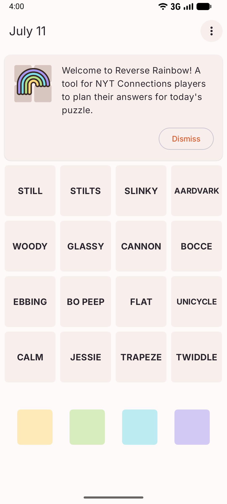
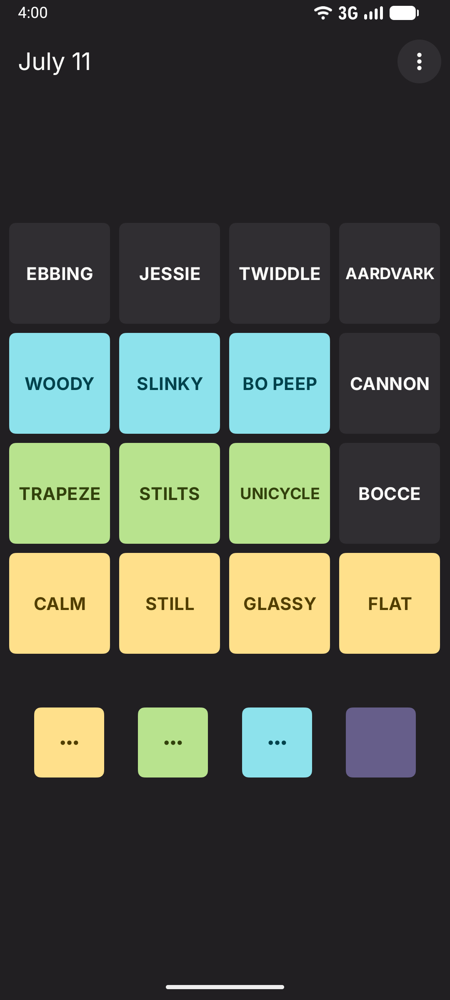
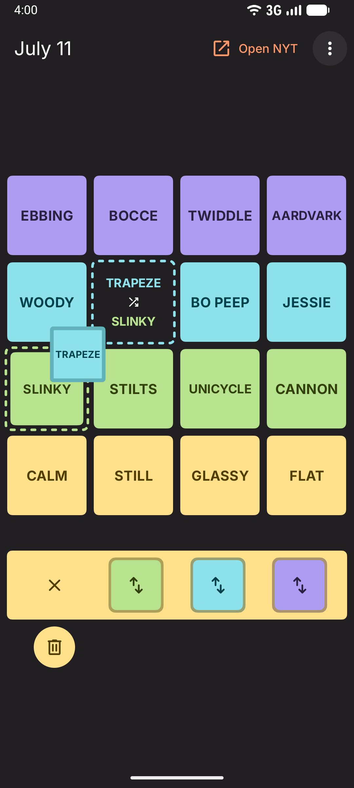

# Reverse Rainbow

An app for those who like to solve the New York Times Connections puzzles in reverse order, this
application allows you to plan your answers for today's game ahead of time.

Initially built as an Android application, it's also available on the web at [reverserainbow.app](https://reverserainbow.app).

> [!IMPORTANT]  
> This application is not associated with the New York Times. It also does not allow you to play
> Connections - only plan your answers.

  
  
  

### Anything interesting about this repo?

There's nothing too exotic in here. It's a [Compose Multiplatform](https://kotlinlang.org/compose-multiplatform/)
project that aims to have a smaller number of dependencies. (Though if you look at
`gradle/libs.versions.toml` you can see it wasn't that successful). However it does at least shirk
the usual plethora of dependency injection and navigation libraries while still trying to be a
simple, testable Compose UI codebase.

## License

    Licensed under the Apache License, Version 2.0 (the "License");
    you may not use this file except in compliance with the License.
    You may obtain a copy of the License at

       http://www.apache.org/licenses/LICENSE-2.0

    Unless required by applicable law or agreed to in writing, software
    distributed under the License is distributed on an "AS IS" BASIS,
    WITHOUT WARRANTIES OR CONDITIONS OF ANY KIND, either express or implied.
    See the License for the specific language governing permissions and
    limitations under the License.
